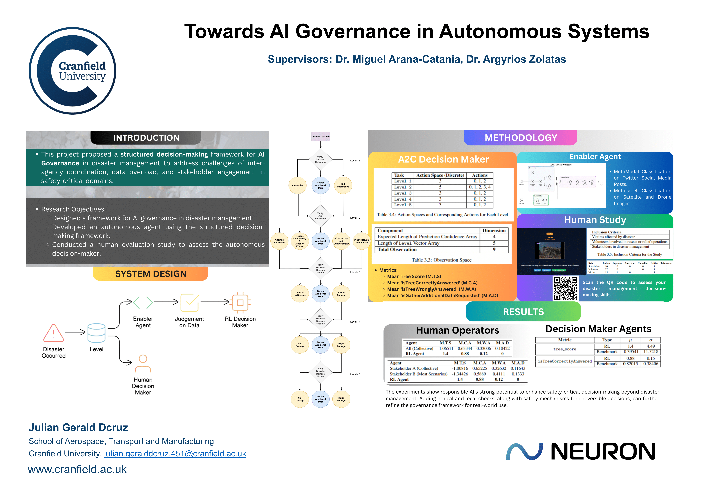

# Towards AI Governance in Autonomous Systems

With artificial intelligence (AI) being applied to bring autonomy to decision-making in safety-critical domains such as military, aerospace, and emergency services, there has been a call to address the ethical implications such as accountability, transparency, and structured decision-making in decisions concerning human lives, through AI governance towards building responsible AI applications. This thesis addresses these challenges by proposing a structured decision-making framework that integrates governance into autonomous decision-making specifically within disaster-management. By introducing concepts of `Enabler` agents, `Levels`, and `Scenarios`, this framework's performance is rigorously evaluated against systems that rely solely on judgement-based insights, as well as human operators who have disaster experience: victims, volunteers, stakeholders through a comprehensive evaluation study. The results demonstrate that the structured decision-making framework achieves 60.94% greater stability in consistently accurate decisions across multiple `Scenarios`, compared to judgement-based systems. Moreover, the framework outperforms human operators with a 38.93% higher accuracy across various `Scenarios`. To further advance responsible AI, this framework can be enhanced with validation checks for ethical and legal regulations, and the implementation of safety mechanisms for irreversible decisions, thereby extending its practical applications in safety-critical missions.